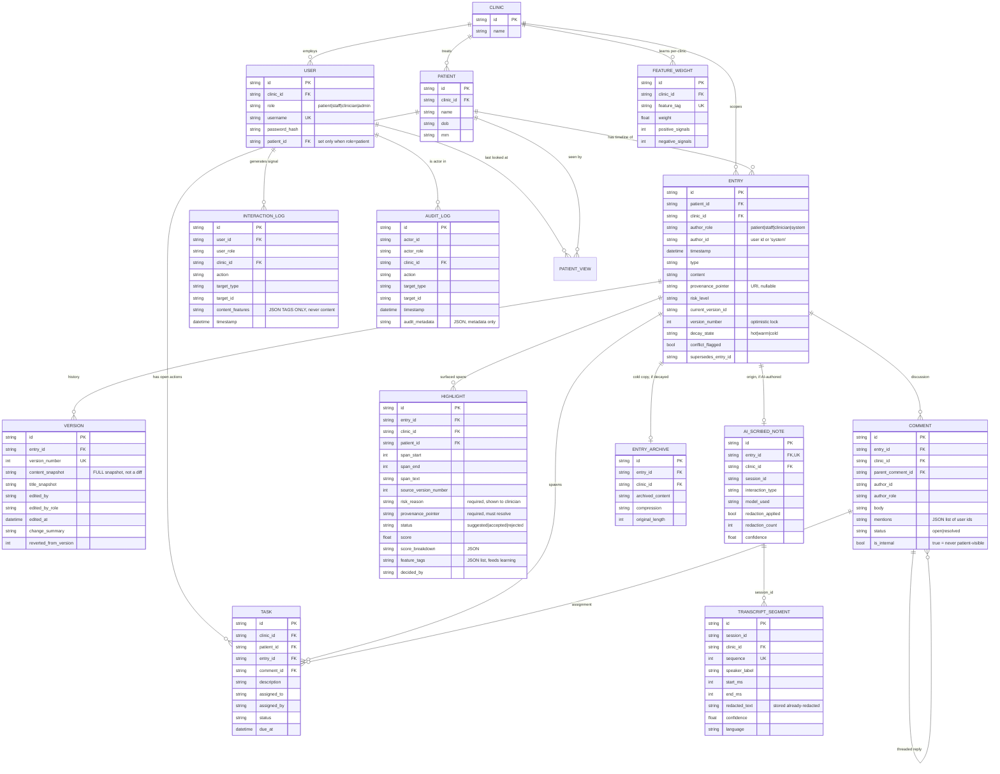
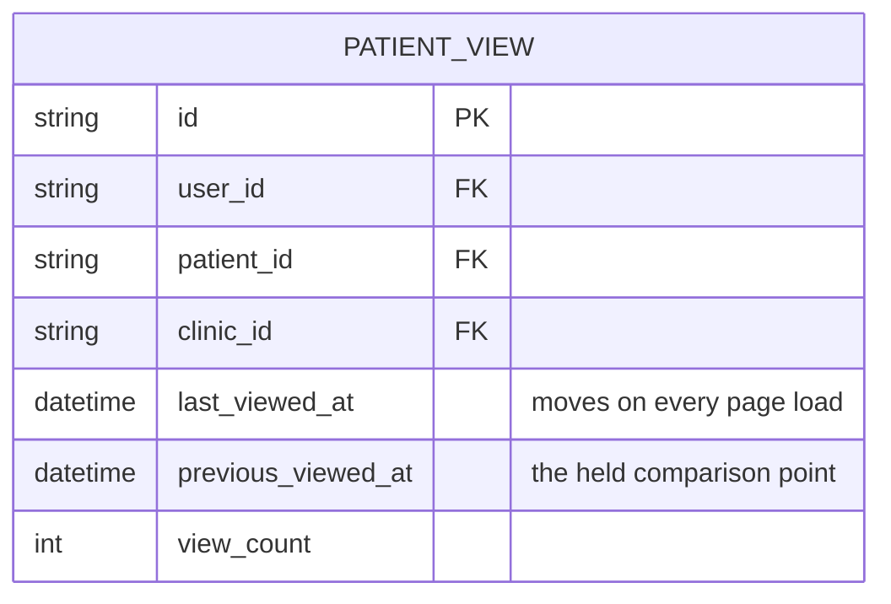

# Data Schema

Source of truth: `backend/app/models.py`. This document explains the shape and
the reasoning; the code is authoritative on field types.

---

## ER diagram



---

## How the required relationships link up

The brief asks specifically how **Entries ↔ Comments ↔ Versions ↔ Highlights ↔
Provenance ↔ AI_Scribed_Notes** connect. `Entry` is the hub:

| Relationship | Mechanism |
|---|---|
| Entry → Versions | `Version.entry_id`, unique on `(entry_id, version_number)`. Entry holds `current_version_id` and `version_number`. |
| Entry → Comments | `Comment.entry_id`; threads via self-referential `parent_comment_id`. |
| Entry → Highlights | `Highlight.entry_id` plus a character span (`span_start`, `span_end`) and the `source_version_number` the span was computed against — so an edit cannot silently move a highlight onto different text. |
| Entry → AIScribedNote | One-to-one (`unique=True` on `entry_id`). Presence of this row *is* the marker that an entry is AI-scribed; `author_role='system'` is the denormalised fast check. |
| AIScribedNote → transcript | `session_id`, shared with `TranscriptSegment.session_id`. |
| Anything → Provenance | A **string URI**, not a foreign key (see below). |

### Provenance is a URI, not a foreign key

`provenance_pointer` is a string with a small grammar
(`backend/app/core/provenance.py`):

```
entry://<entry_id>
entry://<entry_id>#span:<start>-<end>
session://<session_id>#turn:<n>
transcript://<session_id>#segment:<sequence>
```

A foreign key can only point at one table's rows. Provenance targets are
heterogeneous — sometimes a whole entry, sometimes a character range inside one,
sometimes a turn in an AI session or a diarised segment of audio that is not a
row in this database at all. One resolvable string covers all of them and keeps
the "click a highlight, land on the source" requirement to a single code path.

The trade-off is that the database will not enforce referential integrity for
us, so a pointer can dangle. We handle that by making `resolve()` the only way
to dereference one, and having it raise on a dangling or out-of-range pointer
rather than returning empty. `resolve()` also takes a `clinic_id` and enforces
it — a valid pointer must never become a read primitive across a tenant
boundary.

---

## Decisions embedded in the schema

**`clinic_id` is denormalised onto every clinically-scoped table**, even where it
is derivable by a join through `patient_id`. This is what lets
`AccessScope.query()` apply one uniform predicate to any model without knowing
its shape, and it is why `AccessScope` can *refuse* to query a model that lacks
the column. Redundancy bought a fail-closed default.

**Versions store full snapshots, not diffs** (DECISIONS.md D-006). Revert becomes
a copy rather than a replay of an inverse patch chain — much harder to get
subtly wrong, and the correctness of revert is directly graded. Diffs for "view
changes since X" are computed on read with `difflib`. At prototype scale the
storage cost is irrelevant; at real scale the decay policy below is the answer.

**Reverting creates a new version** rather than deleting history. `Version` rows
are append-only; `reverted_from_version` records what a revert was reverting to.
An audit trail that can be rewritten is not an audit trail.

**`InteractionLog.content_features` holds extracted tags only** (e.g.
`["med:warfarin", "section:plan"]`), never the content itself. This is both a
privacy property — the learning substrate contains no clinical prose — and the
thing that makes learning generalise: a tag transfers across entries in a way a
verbatim string never could.

**`FeatureWeight` is scoped per clinic.** One clinic's attention habits must not
influence another's prioritisation, for the same reason patient data is
partitioned.

---

## Data decay (Phase 4, designed now)

`Entry.decay_state` moves `hot → warm → cold`:

| State | Content | Glance View |
|---|---|---|
| `hot` | full, in `Entry.content` | full scoring eligibility |
| `warm` | full, in `Entry.content` | recency multiplier down-weighted |
| `cold` | `Entry.content` replaced by a compressed summary; original moved to `EntryArchive` | excluded from scoring; retrievable on demand |

Modelling this in Phase 0 rather than bolting it on later means `decay_state` is
available to the Glance View scorer from the moment that scorer exists, so the
"data decay" bonus becomes a policy question rather than a migration.

The safety constraint on decay: an entry is never eligible for `cold` while it
has an unresolved `Task`, an open `Comment`, or an accepted `Highlight`. Old
does not mean unimportant, and an outstanding action is the clearest possible
signal that something still matters.

---

## Phase 1 additions

No schema changes. The Phase 0 model set covered the walking skeleton without
alteration, which was one of the things Phase 1 was meant to find out. What
changed is which invariants are now *enforced by code* rather than only
intended:

**`Entry.provenance_pointer` is never null in practice.** The column remains
nullable in the model, but every write path sets it (D-024):

| Entry origin | Pointer |
|---|---|
| Manually authored | `entry://<its own id>` — written here, not derived |
| AI-scribed | `session://<session_id>` — resolves via `AIScribedNote` to the interaction |

Leaving it null for manual notes was the alternative. Rejected: every consumer
would need a null branch, and the first to forget it produces an entry with no
traceable origin, in a product whose central claim is that everything is
traceable.

**Every `Entry` has a `Version` from the moment it exists.** `create_entry` and
the seed both write `Version` number 1 and set `current_version_id` in the same
transaction. No row can exist with a `version_number` that has no corresponding
`Version`, so Phase 2's revision history only ever appends rather than having to
back-fill an origin.

**`AuditLog.audit_metadata` carries a content *length*, never content.** For
`entry.create` it holds `{type, version, content_length, injection_markers}`.
Asserted in `test_phase1_skeleton.py`: a note body written into an entry does
not appear anywhere in its audit row.

**Provenance resolution is clinic-scoped.** `resolve(db, pointer, clinic_id=…)`
refuses a pointer whose target lives in another clinic, so a syntactically valid
pointer cannot be used as a side channel around the RBAC layer. Verified against
the seeded AI note.

---

## Phase 2 additions

### New entity: `PATIENT_VIEW`



Two timestamps rather than one. `last_viewed_at` advances every load;
`previous_viewed_at` is what "new since your last visit" actually compares
against, and only rolls forward once more than twenty minutes have passed. With
a single timestamp, opening the Glance View would clear the very thing it just
showed you — a refresh, or a second monitor, and the news is gone (D-033).

Unique on `(user_id, patient_id)`: the marker is per person, not per clinic.
Two clinicians reading the same chart have different ideas of what is new,
because they last looked at different times.

### How the required relationships link up, end to end

The brief asks for Entries ↔ Comments ↔ Versions ↔ Highlights ↔ Provenance ↔
AI_Scribed_Notes. As built:

| Link | Mechanism | Where |
|---|---|---|
| Entry → Version | `Version.entry_id`, unique on `(entry_id, version_number)`; `Entry.current_version_id` points at the head | `entry_routes._append_version` |
| Entry → Comment | `Comment.entry_id`; self-referencing `parent_comment_id` gives threads | `comment_routes.list_comments` |
| Entry → Highlight | `Highlight.entry_id` **plus** `source_version_number` — a highlight belongs to an entry *at a version* | `services/highlights.py` |
| Entry → AIScribedNote | one-to-one on `entry_id` (unique), set only by the scribe pipeline | `services/scribe.run_scribe` |
| AIScribedNote → TranscriptSegment | shared `session_id`, not a foreign key — segments outlive any one summary | `core/provenance.resolve` |
| Highlight → source span | `provenance_pointer` = `entry://<id>#span:<start>-<end>` | `core/provenance.entry_pointer` |
| Entry → originating session | `provenance_pointer` = `session://<session_id>` | `services/scribe.run_scribe` |
| Entry → superseded Entry | `supersedes_entry_id` on the correction, `conflict_flagged` on the original | `entry_routes.supersede_entry` |
| Interaction → learned weight | `InteractionLog.content_features` (tags) aggregated into `FeatureWeight` keyed `(clinic_id, feature_tag)` | Phase 4; tags written from Phase 2 |

The learning path is worth stating explicitly because it is the one link that is
not yet closed. `InteractionLog` rows are written from Phase 2 onward — every
manual highlight, edit, comment, accept and reject records the *feature tags* of
what was touched. `FeatureWeight` is read by `scoring.learned_component()` and
currently returns 0.0 because nothing writes to it yet. Phase 4 closes the loop
by aggregating the former into the latter; no schema change is required, and no
scoring consumer changes shape.

### Why highlights carry a version number

`Highlight.source_version_number` is the anchor. Staleness is a comparison, not
a stored flag:

```python
stale = highlight.source_version_number != entry.version_number
```

A stale highlight resolves its span text against the `Version` snapshot it was
made against, not against current content. Storing a boolean would mean an edit
has to remember to update every highlight on the entry; deriving it means the
answer cannot drift from the truth (D-030).

### Two things deliberately *not* modelled

**No `Notification` table.** Mentions store user ids on the comment. A real
notification system needs delivery state, read receipts and a channel per user;
none of that is exercised by the brief, and a half-built one implies a promise
the product cannot keep.

**No `Session` table for AI-patient sessions.** `session_id` is a string shared
by `AIScribedNote` and `TranscriptSegment` rather than a row. The pointer
grammar already resolves it, and a table would add a join to every provenance
lookup to store a value that is only ever an identity.
