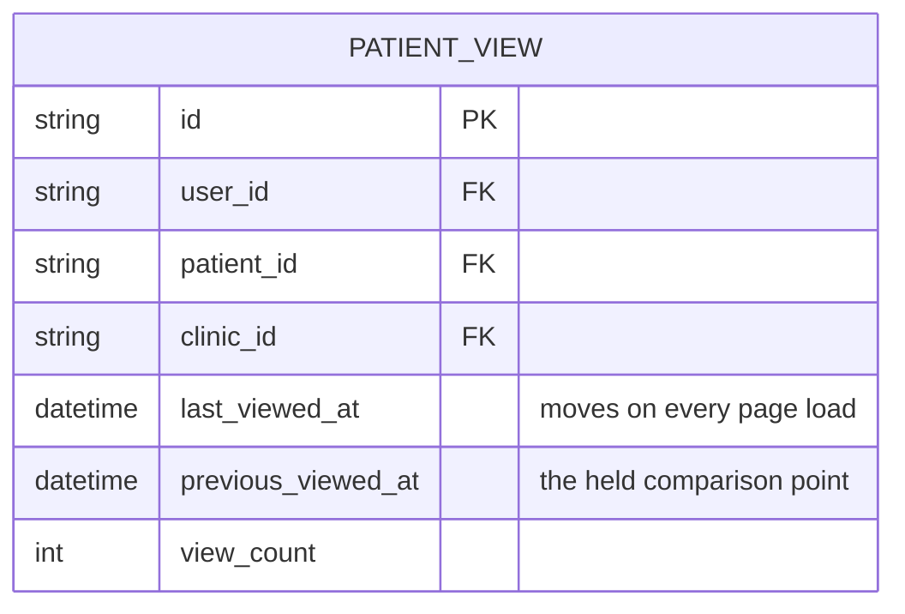

# Data Schema

Source of truth: `backend/app/models.py`. This document explains the shape and
the reasoning; the code is authoritative on field types.

---

## ER diagram

```mermaid
erDiagram
    CLINIC ||--o{ USER : "employs"
    CLINIC ||--o{ PATIENT : "treats"
    CLINIC ||--o{ ENTRY : "scopes"

    PATIENT ||--o{ ENTRY : "has timeline of"
    PATIENT ||--o{ TASK : "has open actions"

    ENTRY ||--o{ VERSION : "history"
    ENTRY ||--o{ COMMENT : "discussion"
    ENTRY ||--o{ HIGHLIGHT : "surfaced spans"
    ENTRY ||--o| AI_SCRIBED_NOTE : "origin, if AI-authored"
    ENTRY ||--o| ENTRY_ARCHIVE : "cold copy, if decayed"
    ENTRY ||--o{ TASK : "spawns"

    COMMENT ||--o{ COMMENT : "threaded reply"
    COMMENT ||--o{ TASK : "assignment"

    AI_SCRIBED_NOTE ||--o{ TRANSCRIPT_SEGMENT : "session_id"
    AI_SCRIBED_NOTE ||--o| CAPTURE_SESSION : "recording, if voice-captured"
    ENTRY ||--o{ SUMMARY_ATTRIBUTION : "line-level sources"
    TRANSCRIPT_SEGMENT ||--o{ SUMMARY_ATTRIBUTION : "spoken source of a line"

    USER ||--o{ INTERACTION_LOG : "generates signal"
    USER ||--o{ AUDIT_LOG : "is actor in"
    USER ||--o{ PATIENT_VIEW : "last looked at"
    PATIENT ||--o{ PATIENT_VIEW : "seen by"
    CLINIC ||--o{ FEATURE_WEIGHT : "learns per-clinic"
    CLINIC ||--o{ CAPTURE_SESSION : "scopes"
    PATIENT ||--o{ CAPTURE_SESSION : "recorded during"

    CLINIC {
        string id PK
        string name
    }
    USER {
        string id PK
        string clinic_id FK
        string role "patient|staff|clinician|admin"
        string username UK
        string password_hash
        string patient_id FK "set only when role=patient"
    }
    PATIENT {
        string id PK
        string clinic_id FK
        string name
        string dob "nullable - D-075"
        string mrn "nullable, provisional if unassigned - D-075" 
    }
    ENTRY {
        string id PK
        string patient_id FK
        string clinic_id FK
        string author_role "patient|staff|clinician|system"
        string author_id "user id or 'system'"
        datetime timestamp
        string type
        string content
        string provenance_pointer "URI, nullable"
        string risk_level
        string current_version_id
        int version_number "optimistic lock"
        string decay_state "hot|warm|cold"
        bool conflict_flagged
        string supersedes_entry_id
    }
    VERSION {
        string id PK
        string entry_id FK
        int version_number UK
        string content_snapshot "FULL snapshot, not a diff"
        string title_snapshot
        string edited_by
        string edited_by_role
        datetime edited_at
        string change_summary
        int reverted_from_version
    }
    COMMENT {
        string id PK
        string entry_id FK
        string clinic_id FK
        string parent_comment_id FK
        string author_id
        string author_role
        string body
        string mentions "JSON list of user ids"
        string status "open|resolved"
        bool is_internal "true = never patient-visible"
    }
    HIGHLIGHT {
        string id PK
        string entry_id FK
        string clinic_id FK
        string patient_id FK
        int span_start
        int span_end
        string span_text
        int source_version_number
        string risk_reason "required, shown to clinician"
        string provenance_pointer "required, must resolve"
        string status "suggested|accepted|rejected"
        float score
        string score_breakdown "JSON"
        string feature_tags "JSON list, feeds learning"
        string decided_by
    }
    AI_SCRIBED_NOTE {
        string id PK
        string entry_id FK,UK
        string clinic_id FK
        string session_id
        string interaction_type
        string model_used
        bool redaction_applied
        int redaction_count
        float confidence
    }
    TRANSCRIPT_SEGMENT {
        string id PK
        string session_id
        string clinic_id FK
        int sequence UK
        string speaker_label
        int start_ms
        int end_ms
        string redacted_text "stored already-redacted"
        float confidence
        string language
    }
    PATIENT_VIEW {
        string id PK
        string user_id "who looked"
        string patient_id FK
        string clinic_id FK
        datetime last_viewed_at "drives what-is-new"
        datetime previous_viewed_at "so a reload does not erase the delta"
    }
    CAPTURE_SESSION {
        string id PK
        string session_id UK "joins capture to segments and entry"
        string clinic_id FK
        string patient_id FK
        string entry_id FK "null until the scribe completes"
        string kind "patient|clinical"
        string source "live_recording|audio_upload|transcript_upload"
        string asr_provider "stub|local|remote|none"
        string asr_model
        bool transcription_simulated "the honesty flag"
        int audio_bytes_received
        bool audio_retained "always false, asserted by test"
        int duration_ms
        int segment_count
        string languages "JSON list, e.g. [en, en-ms]"
        float mean_confidence
        int low_confidence_segments
        int overlap_segments
        int redaction_count
        string device_label
        string created_by
        string created_by_role
    }
    SUMMARY_ATTRIBUTION {
        string id PK
        string entry_id FK
        string clinic_id FK
        string session_id "the transcript run"
        int span_start "char offset into Entry.content"
        int span_end
        int source_version_number "offsets belong to one version"
        int segment_sequence FK "TranscriptSegment.sequence"
        string provenance_pointer "transcript://session#segment:n"
        string match_type "verbatim|derived"
        float match_score
    }
    TASK {
        string id PK
        string clinic_id FK
        string patient_id FK
        string entry_id FK
        string comment_id FK
        string description
        string assigned_to
        string assigned_by
        string status
        datetime due_at
    }
    INTERACTION_LOG {
        string id PK
        string user_id FK
        string user_role
        string clinic_id FK
        string action
        string target_type
        string target_id
        string content_features "JSON TAGS ONLY, never content"
        datetime timestamp
    }
    FEATURE_WEIGHT {
        string id PK
        string clinic_id FK
        string feature_tag UK
        float weight
        int positive_signals
        int negative_signals
    }
    AUDIT_LOG {
        string id PK
        string actor_id
        string actor_role
        string clinic_id FK
        string action
        string target_type
        string target_id
        datetime timestamp
        string audit_metadata "JSON, metadata only"
    }
    ENTRY_ARCHIVE {
        string id PK
        string entry_id FK
        string clinic_id FK
        string archived_content
        string compression
        int original_length
    }
```



---

## How the required relationships link up

The brief asks specifically how **Entries ↔ Comments ↔ Versions ↔ Highlights ↔
Provenance ↔ AI_Scribed_Notes** connect. `Entry` is the hub:

| Relationship | Mechanism |
|---|---|
| Entry → Versions | `Version.entry_id`, unique on `(entry_id, version_number)`. Entry holds `current_version_id` and `version_number`. |
| Entry → Comments | `Comment.entry_id`; threads via self-referential `parent_comment_id`. |
| Entry → Highlights | `Highlight.entry_id` plus a character span (`span_start`, `span_end`) and the `source_version_number` the span was computed against — so an edit cannot silently move a highlight onto different text. |
| Entry → AIScribedNote | One-to-one (`unique=True` on `entry_id`). Presence of this row *is* the marker that an entry is AI-scribed; `author_role='system'` is the denormalised fast check. |
| AIScribedNote → transcript | `session_id`, shared with `TranscriptSegment.session_id`. |
| Anything → Provenance | A **string URI**, not a foreign key (see below). |

### Provenance is a URI, not a foreign key

`provenance_pointer` is a string with a small grammar
(`backend/app/core/provenance.py`):

```
entry://<entry_id>
entry://<entry_id>#span:<start>-<end>
session://<session_id>#turn:<n>
transcript://<session_id>#segment:<sequence>
```

A foreign key can only point at one table's rows. Provenance targets are
heterogeneous — sometimes a whole entry, sometimes a character range inside one,
sometimes a turn in an AI session or a diarised segment of audio that is not a
row in this database at all. One resolvable string covers all of them and keeps
the "click a highlight, land on the source" requirement to a single code path.

The trade-off is that the database will not enforce referential integrity for
us, so a pointer can dangle. We handle that by making `resolve()` the only way
to dereference one, and having it raise on a dangling or out-of-range pointer
rather than returning empty. `resolve()` also takes a `clinic_id` and enforces
it — a valid pointer must never become a read primitive across a tenant
boundary.

---

## Decisions embedded in the schema

**`clinic_id` is denormalised onto every clinically-scoped table**, even where it
is derivable by a join through `patient_id`. This is what lets
`AccessScope.query()` apply one uniform predicate to any model without knowing
its shape, and it is why `AccessScope` can *refuse* to query a model that lacks
the column. Redundancy bought a fail-closed default.

**Versions store full snapshots, not diffs** (DECISIONS.md D-006). Revert becomes
a copy rather than a replay of an inverse patch chain — much harder to get
subtly wrong, and the correctness of revert is directly graded. Diffs for "view
changes since X" are computed on read with `difflib`. At prototype scale the
storage cost is irrelevant; at real scale the decay policy below is the answer.

**Reverting creates a new version** rather than deleting history. `Version` rows
are append-only; `reverted_from_version` records what a revert was reverting to.
An audit trail that can be rewritten is not an audit trail.

**`InteractionLog.content_features` holds extracted tags only** (e.g.
`["med:warfarin", "section:plan"]`), never the content itself. This is both a
privacy property — the learning substrate contains no clinical prose — and the
thing that makes learning generalise: a tag transfers across entries in a way a
verbatim string never could.

**`FeatureWeight` is scoped per clinic.** One clinic's attention habits must not
influence another's prioritisation, for the same reason patient data is
partitioned.

---

## Data decay (designed Phase 0, built Phase 4)

`Entry.decay_state` moves `hot → warm → cold`:

| State | Content | Glance View |
|---|---|---|
| `hot` | full, in `Entry.content` | full scoring eligibility |
| `warm` | full, in `Entry.content` | score × 0.7 |
| `cold` | `Entry.content` replaced by an extractive summary; original compressed into `EntryArchive` | score × 0.4 — **down-weighted, never excluded** |

> **Correction (Phase 4).** This table previously said cold entries were
> *excluded* from scoring. Building the policy showed that to be wrong, and the
> code never did it: `scoring.DECAY_MULTIPLIER` puts cold at 0.4. An entry can
> be the only record of an allergy and still be four years old. Age is a prior
> about relevance, never a proof of irrelevance. See D-042.

Modelling this in Phase 0 rather than bolting it on later means `decay_state` is
available to the Glance View scorer from the moment that scorer exists, so the
"data decay" bonus became a policy question rather than a migration.

### What is never compressed

An entry is held at `warm` regardless of age when it has an unresolved `Task`,
an open `Comment`, an accepted `Highlight`, a flagged conflict, a `risk_level`
of `high`/`critical`, or content tagged with safety-critical vocabulary
(allergy, anaphylaxis, sepsis, self-harm). Old does not mean settled, and an
outstanding action is the clearest possible signal that something still matters.

### Two columns Phase 4 added

| Column | Why |
|---|---|
| `Entry.decay_hold_until` | Set by a manual restore. Without it, a clinician who reopened a four-year-old note to read it properly would find it recompressed by the next pass — which reads as the system arguing with them (D-043). |
| `EntryArchive.compression` | Now carries a real value (`zlib+base64`) rather than `none`. |

### Compression is reversible, and its cost is reported

`EntryArchive.archived_content` holds the zlib-compressed, base64-encoded
original, and `restore()` returns it byte for byte —
`test_data_decay.py::test_compression_is_reversible_byte_for_byte` asserts exact
equality, because a lossy archival step in a clinical record is a data-loss bug
with a scheduler attached.

The saving is on the **read path**, and the decay report says so rather than
netting the two figures into one flattering number. On the seeded note:

| Measure | Bytes |
|---|---|
| `Entry.content` before | 455 |
| `Entry.content` after | 64 |
| `EntryArchive` cost | +376 |
| Net storage delta | −15 |

Base64 inflates zlib's output by about a third, so at these note lengths the
archive eats nearly the whole saving. What compression genuinely buys here is a
7× smaller hot row — the thing a timeline load actually reads. Total storage
only turns meaningfully positive on notes of a few KB, where the compression
ratio beats that overhead. Reporting a single "bytes saved" figure would have
concealed exactly that, so `decay.run()` returns `hot_bytes_*` and
`archive_bytes` separately.

### Offsets index the original, not the summary

Every span pointer (`entry://<id>#span:12-48`) was computed against the entry's
full text. Compressing `Entry.content` without redirecting resolution would move
every offset onto different words — or overrun the end and report a dangling
pointer for a highlight that is perfectly valid, breaking the requirement
`test_highlight_provenance.py` exists to protect.

`provenance.resolve()` therefore reads through `decay.original_content()`, which
returns the archived original for cold entries. Cold storage changes what is
cheap to read, not what is true. For the same reason a cold entry stops
*minting* new spans (`refresh_entry_highlights` skips generation and only
rescores): two incompatible offset frames in one table would be worse than
fewer suggestions.

---

## Phase 1 additions

No schema changes. The Phase 0 model set covered the walking skeleton without
alteration, which was one of the things Phase 1 was meant to find out. What
changed is which invariants are now *enforced by code* rather than only
intended:

**`Entry.provenance_pointer` is never null in practice.** The column remains
nullable in the model, but every write path sets it (D-024):

| Entry origin | Pointer |
|---|---|
| Manually authored | `entry://<its own id>` — written here, not derived |
| AI-scribed | `session://<session_id>` — resolves via `AIScribedNote` to the interaction |

Leaving it null for manual notes was the alternative. Rejected: every consumer
would need a null branch, and the first to forget it produces an entry with no
traceable origin, in a product whose central claim is that everything is
traceable.

**Every `Entry` has a `Version` from the moment it exists.** `create_entry` and
the seed both write `Version` number 1 and set `current_version_id` in the same
transaction. No row can exist with a `version_number` that has no corresponding
`Version`, so Phase 2's revision history only ever appends rather than having to
back-fill an origin.

**`AuditLog.audit_metadata` carries a content *length*, never content.** For
`entry.create` it holds `{type, version, content_length, injection_markers}`.
Asserted in `test_phase1_skeleton.py`: a note body written into an entry does
not appear anywhere in its audit row.

**Provenance resolution is clinic-scoped.** `resolve(db, pointer, clinic_id=…)`
refuses a pointer whose target lives in another clinic, so a syntactically valid
pointer cannot be used as a side channel around the RBAC layer. Verified against
the seeded AI note.

---

## Phase 2 additions

### New entity: `PATIENT_VIEW`



Two timestamps rather than one. `last_viewed_at` advances every load;
`previous_viewed_at` is what "new since your last visit" actually compares
against, and only rolls forward once more than twenty minutes have passed. With
a single timestamp, opening the Glance View would clear the very thing it just
showed you — a refresh, or a second monitor, and the news is gone (D-033).

Unique on `(user_id, patient_id)`: the marker is per person, not per clinic.
Two clinicians reading the same chart have different ideas of what is new,
because they last looked at different times.

### How the required relationships link up, end to end

The brief asks for Entries ↔ Comments ↔ Versions ↔ Highlights ↔ Provenance ↔
AI_Scribed_Notes. As built:

| Link | Mechanism | Where |
|---|---|---|
| Entry → Version | `Version.entry_id`, unique on `(entry_id, version_number)`; `Entry.current_version_id` points at the head | `entry_routes._append_version` |
| Entry → Comment | `Comment.entry_id`; self-referencing `parent_comment_id` gives threads | `comment_routes.list_comments` |
| Entry → Highlight | `Highlight.entry_id` **plus** `source_version_number` — a highlight belongs to an entry *at a version* | `services/highlights.py` |
| Entry → AIScribedNote | one-to-one on `entry_id` (unique), set only by the scribe pipeline | `services/scribe.run_scribe` |
| AIScribedNote → TranscriptSegment | shared `session_id`, not a foreign key — segments outlive any one summary | `core/provenance.resolve` |
| Highlight → source span | `provenance_pointer` = `entry://<id>#span:<start>-<end>` | `core/provenance.entry_pointer` |
| Entry → originating session | `provenance_pointer` = `session://<session_id>` | `services/scribe.run_scribe` |
| Entry → superseded Entry | `supersedes_entry_id` on the correction, `conflict_flagged` on the original | `entry_routes.supersede_entry` |
| Interaction → learned weight | `InteractionLog.content_features` (tags) aggregated into `FeatureWeight` keyed `(clinic_id, feature_tag)` | Phase 4; tags written from Phase 2 |

The learning path is worth stating explicitly because it is the one link that is
not yet closed. `InteractionLog` rows are written from Phase 2 onward — every
manual highlight, edit, comment, accept and reject records the *feature tags* of
what was touched. `FeatureWeight` is read by `scoring.learned_component()` and
currently returns 0.0 because nothing writes to it yet. Phase 4 closes the loop
by aggregating the former into the latter; no schema change is required, and no
scoring consumer changes shape.

### Why highlights carry a version number

`Highlight.source_version_number` is the anchor. Staleness is a comparison, not
a stored flag:

```python
stale = highlight.source_version_number != entry.version_number
```

A stale highlight resolves its span text against the `Version` snapshot it was
made against, not against current content. Storing a boolean would mean an edit
has to remember to update every highlight on the entry; deriving it means the
answer cannot drift from the truth (D-030).

### Two things deliberately *not* modelled

**No `Notification` table.** Mentions store user ids on the comment. A real
notification system needs delivery state, read receipts and a channel per user;
none of that is exercised by the brief, and a half-built one implies a promise
the product cannot keep.

**No `Session` table for AI-patient sessions.** `session_id` is a string shared
by `AIScribedNote` and `TranscriptSegment` rather than a row. The pointer
grammar already resolves it, and a table would add a join to every provenance
lookup to store a value that is only ever an identity.

---

## Phase 4 additions

No new tables. `InteractionLog`, `FeatureWeight` and `EntryArchive` were all
modelled in Phase 0 and are finally written to; the only structural change is
`Entry.decay_hold_until` (above). That the schema survived contact with the
feature it was designed for is the main thing this phase says about it.

### The learning path, now closed

Phase 2's `SCHEMA.md` listed one link as not yet connected:

> `Interaction → learned weight` — Phase 4; tags written from Phase 2.

It is connected now, and the direction of the dependency is the important part:

```
InteractionLog.content_features   (tags only, never prose)
        │
        │  weighted by action type, decayed by age (90-day half-life),
        │  filtered to clinician/staff, scoped to one clinic
        ▼
FeatureWeight (clinic_id, feature_tag) → weight ∈ (−1, 1)
        │
        ▼
scoring.learned_component()  →  W_LEARNED × mean(weights of this span's tags)
```

**`FeatureWeight` is a materialised view over `InteractionLog`, not a second
record.** `learning.recompute_tags()` (incremental, on every write path) and
`learning.rebuild_clinic()` (full) run the *same* accumulation function, so they
cannot drift, and the weights can always be reconstructed from the log alone.
`test_self_learning_importance.py::test_rebuilding_from_the_log_reproduces_the_incremental_weights`
asserts that equality directly. If the two could disagree, the weights would
become an unauditable second record of clinician behaviour.

A tag with no learning-eligible evidence gets **no row at all** rather than a
row with weight 0.0 — otherwise it would appear on the transparency surface as
something the clinic has an opinion about, which is the opposite of true.

### Which tags are learnable

| Tag shape | Learnable | Why |
|---|---|---|
| `med:*`, `medclass:*`, `symptom:*`, `finding:*`, `entity:*`, `action:*` | yes | clinical vocabulary — transfers between entries |
| `type:*`, `source:*`, `signal:*` | no | describes the container. `type:staff_note` appears on every staff note, so weighting it drifts into "staff notes matter" — a statement about authorship, not about the patient |

### Which interactions count

| Action | Signal | Note |
|---|---|---|
| `manual_highlight`, `pin` | +1.0 | strongest: an unambiguous statement about importance |
| `accept_highlight` | +0.8 | explicit confirmation of a machine claim |
| `reject_highlight` | −0.8 | explicit rejection |
| `comment` | +0.4 | attention, but entry-wide rather than span-specific |
| `edit` | +0.3 | engagement with existing content |
| `resolve_comment` | +0.1 | weak positive |
| `create` | 0.0 | recorded, not learned from — authorship is volume, not attention (D-039) |
| `view` | 0.0 | recorded, not learned from — unavoidable, so it would learn "everything matters" |

Only `clinician` and `staff` rows train the ranking. Admin is excluded for the
same reason it cannot author clinical content (D-011). Patients are excluded
because the surface being trained is the clinician Glance View.

### The known scaling cost

`recompute_tags()` prefilters `InteractionLog` with a SQL `LIKE` over the JSON
`content_features` string, then matches exactly in Python. `_` is a `LIKE`
wildcard and several tags contain one, so the SQL is a prefilter and never the
decision. This is one unindexed scan per write path. The right answer at real
volume is a normalised `interaction_tags` join table:

```
INTERACTION_TAG {
    string interaction_id FK
    string feature_tag    "indexed, with (clinic_id, feature_tag)"
}
```

Not built: it adds a write-amplification path and a migration to buy performance
this prototype cannot demonstrate needing. Recorded here rather than discovered
later.

---

## Phase 5 additions

Two tables, and one clarification about which of them is load-bearing.

### `CAPTURE_SESSION` — everything about the recording except the recording

One row per ambient capture. It holds what a reviewer needs to judge a
voice-derived note: how long the recording was, what transcribed it, how many
identifiers came out, how confident the recogniser was, and how many bytes of
audio arrived.

The column that matters most is `audio_retained`, which is always `false`.
Storing a boolean that never varies looks like dead weight until you ask how a
reviewer would otherwise check the claim. A sentence in a README is an
assertion; a column is a fact a test can walk
(`test_audio_is_never_retained` iterates every column on the row looking for the
bytes). `audio_bytes_received` sits beside it so the pair reads as an
accounting: this much arrived, none of it was kept. See D-045.

`transcription_simulated` is the second honesty column. With no ASR provider
configured the stub cannot really transcribe, and that flag propagates to the
entry card, the transcript panel and the API's `notice` string rather than
letting an interface imply speech recognition happened (D-046).

`session_id` is the join key, not `id`. One string — carried on the Entry's
`provenance_pointer`, on every `TranscriptSegment`, and here — links capture →
segments → note without a chain of foreign keys.

### `SUMMARY_ATTRIBUTION` — which spoken words produced which line

`Entry.provenance_pointer` answers *where did this note come from*. This table
answers *where did that line come from*, which is the question a clinician
actually asks.

```
Entry.content
  "- Ankle swelling is a known side effect of amlodipine..."
   ^span_start                                     ^span_end
        │
        └── SummaryAttribution ──► transcript://cap-…#segment:8
                                        │
                                        └── TranscriptSegment(sequence=8)
                                              speaker=clinician, 31.6s, conf 0.86
```

Three properties worth stating explicitly:

* **Rows exist only where a link could be established.** A line matching nothing
  gets no row and the UI shows no source, rather than a plausible pointer to
  somewhere nearby (D-048). Absence of a row is information.
* **`match_type` distinguishes proof from inference.** `verbatim` means the
  segment's words are in the line and anyone can re-derive it; `derived` means
  vocabulary overlap survived rewording. The UI labels them differently because
  they are different strengths of evidence.
* **`source_version_number` scopes the offsets.** Character offsets are only
  meaningful against the text they were computed from. An edit creates a new
  version and the rows are rebuilt for it rather than appended to — the same
  reasoning as `Highlight.source_version_number` (see "Why highlights carry a
  version number" above), and for the same failure it prevents: an offset
  surviving into a version where it now addresses different words.

### Which table is load-bearing

`SUMMARY_ATTRIBUTION` is. `CAPTURE_SESSION` is not.

Attribution is generated inside `run_scribe`, so **every** AI-scribed note gets
line-level provenance — the Phase 2 fixture path already wrote transcript
segments, and the matching is the same work (D-054). A capture row exists only
when there was an actual recording.

This is why `GET /captures/{session_id}` is keyed on the segments rather than on
the capture row, and returns `capture: null` for a fixture-generated session.
Keying it the other way made the endpoint report "no transcript is stored" for
notes whose transcript was sitting right there.

### What Phase 5 did not need to change

Nothing in `ENTRY`, `AI_SCRIBED_NOTE` or `TRANSCRIPT_SEGMENT`. Voice capture
produces entries through the same `run_scribe` path as Phase 2's fixtures, with
the same metadata contract, because Phase 0 modelled transcripts as
speaker-labelled turns with timings and confidence rather than as flat text —
and `TRANSCRIPT_SEGMENT` was commented from the start as a Phase 5 provenance
target. Ambient capture changes where the words come from and nothing else.

---

## Phase 9 schema changes

Three changes, all from the clinic-scenario review. No new tables.

### `AIScribedNote.unreadable_segment_count` (new column)

Integer, default 0. Transcript turns that carried clinical weight but produced no
tags, because they were in a language this build has no vocabulary for.

Stored rather than recomputed for two reasons: the Glance View would otherwise
re-tag an entire transcript on every load, and a count that only exists at render
time cannot be audited after the fact. Surfaced as a Glance View flag distinct
from low confidence — "the system read this and is unsure" and "the system did
not read part of this" are different warnings (D-072).

### `Patient.dob` and `Patient.mrn` are now nullable

Both were `NOT NULL`. Requiring a date of birth before a patient can exist
excludes anyone who does not know it or will not give it at a front desk;
requiring an MRN means she cannot be registered until some other system has
assigned one. The schema was a second, quieter way of deciding that a patient
known only as a phone number was not a patient.

Enrolment issues a provisional MRN (`PROV-XXXXXXXX`) rather than refusing, so the
field stays useful where a clinic does assign numbers (D-075).

**Migration note:** `Base.metadata.create_all` does not alter existing tables. A
development database created before this commit needs re-seeding —
`rm carenote.db && python backend/init_db.py`.

### Delivery state — derived, not stored

`services/delivery.py` computes `unread` / `read` / `corrected` per patient-facing
entry from data already present:

| Input | Source |
|---|---|
| when the patient last opened her record | `PatientView.last_viewed_at` (D-033) |
| when this entry was first readable | earliest `Version.edited_at` |
| when it last changed | latest `Version.edited_at` |

No new column, because nothing new needed recording — `PatientView` had held the
answer since D-033 and nothing had ever asked it this question. `dispatched` is
deliberately absent from the state set: nothing dispatches, and modelling the
state would be a false assurance in a new place. When a sender exists it slots
between `written` and `read` without disturbing either (D-074).

### Updated relationship notes

| Relationship | Note |
|---|---|
| Patient → User (`role='patient'`) | Optional. A patient with no login is a valid record, reported as `reachable: false` rather than silently treated as unread (D-074, D-075) |
| Entry → Version | The version chain is what makes `corrected` computable; pruning it would break delivery state as well as highlight anchoring (D-030) |
